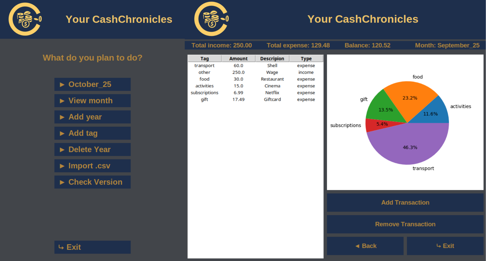

# CashChronicles budgeting Project

## Preview


## Features/Usage
Get an overview of you expenses <br>
### Select a months expenses overview:
> View Month -> Select Month to view from Dropdown Menu -> Confirm <br>
> Requires the addition of a year

### Month Overview:
> Top Bar: Overall expenses, income and balance as well as month name <br>
> Left: Table with transactions (tag, amount, description, type) <br>
> Top Right: Pie chart with expenses per tag overview <br>
> Bottom right: Add/Remove transactions, Back and Exit

### Add a year to the overview (Jan-Dec):
> Add year -> Type year (15-50) -> select in Month to view

### Add/Remove transactions:
> Add: Add -> configure transaction -> Add <br>
> Remove: Select transaction (click on it) -> Press remove button

### Add tag:
> Add a tag that can be used to group expenses in month overview

### Delete Year:
> Delete ALL MONTHS from a specific year <br>
> Will NOT ask to confirm

## How to run

### Easy way:
- Download the executable or binary from the release section and run
- Linux run: `chmod +x /path/to/CashChronicles`
- Linux icon: to add an icon on linux a .desktop file is required

### Alternative way:
- Download source zip
- run from terminal:
```bash
pip install -r requirements.txt
python gui.py
```

## Appdata
- On Windows Appdata is stored inside: `user\Appdata\Roaming\CashChronicles`
- On linux Appdata is stored inside `~/.cash_chronicles`
- AppData contains `cash_chronicles.db` and `config.json`
- To reset the App just delete both and run again

## Inspiration
This is my second budgeting Project. The first one was my inspiration to do this GUI project,
because it was a CLI tool that lacked user friendlyness. It also contained a parser which handled all the data inside .txt files. I wanted to store the transactions in a database and therefore included this change in the new project.

## Tools used
The frontend contains multiple Tkinter pages and displays each one lazily. The backend uses sqlite3 to handle the database connections and to store the transactions
